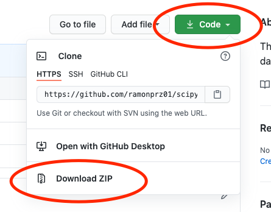

# DB Training Session

Tutorial on Natural Language Processing

### Date: September 9th from 8 to 9 am AEST


# Table of Contents

1. Outline for the Tutorial
2. Prerequisites
3. Goals/Learning Outcomes
4. Setup
5. Presentation (link below)
6. Data
7. Notebooks
    - 00 Flash Intro
    - 01 Static Dashboards
    - 02 Interactive Dashboars
    - 03 Dashboard Deployment
8. Acknowledgements
9. Resources
10. Feedback 😃

Run this tutorial on Binder  
[](https://mybinder.org/v2/gh/ramonpzg/db_training/master)

Run this tutorial on Google Colab  
[](https://drive.google.com/file/d/1SDjnvlfZBQ6VV985SeQkHBp6qRMKgPmE/view?usp=sharing)

https://drive.google.com/file/d/1SDjnvlfZBQ6VV985SeQkHBp6qRMKgPmE/view?usp=sharing

## 3. Goals/Learning Outcomes

It is okay to not understand absolutely everything in the tutorial, instead, I would like to challenge you to first, make sure you walk away with at least 2 new concepts from this lesson, and second, that you come back to it and go over the content you did not get the first time around. That would be one of the best ways to reinforce your understanding of of the concepts covered in this session.

With that said, by the end of the tutorial you will:

1. Have a better understanding of EDA and Hypothesis Testing.
2. Add a new tool for large scale data analysis to your toolkit.
3. Have a better understanding on how to conduct data analysis at scale with Python.
4. Understand the process for breaking apart dashboards and putting them back together with Python.
5. Be able to find a process for looking at data visualizations and figure out a way to break them down and reproduce them.


## 4. Setup

You should first make sure you have [Anaconda](https://www.anaconda.com/products/individual#download-section) or [Miniconda](https://docs.conda.io/en/latest/miniconda.html) installed. This will allow you to have most of the packages you will need for this tutorial already installed once you open up Jupyter Lab.

Here are some of the ways in which you can get the setup for the tutorial ready.

### 4.1 Option 1

#### First Step

Open up your terminal and navigate to a directory of your choosing in your computer. Once there, run the following command.

```sh
 git clone https://github.com/ramonpzg/scipyus21_dask_analytics.git
```

Conversely, you can click on the green `download` button at the top and donwload all files to your desired folder/directory. Once you download it, unzip it and move on to the second step.

#### Second Step

To get all dependancies, packages and everything else that would be useful in this tutorial, you can recreate the environment by first going into the directory for today

```sh
cd scipyus21_dask_analytics
```

and then running

```sh
conda env create -f environment.yml
```

#### Third Step

Then you will need to activate your environment using the following command.

```sh
conda activate us_scipy21
```

#### Fourth Step

Open up Jupyter Lab and you should be ready to go.

```sh
jupyter lab
```


### 4.2 Option 2

#### First Step

Download the repo using the big green button on the upper right.



#### Second Step

Open a Jupyter Lab session inside the folder you just downloaded. You can do this through the Anaconda graphical user interface if you are on a Mac or Windows.

```sh
cd scipyus21_dask_analytics
jupyter lab
```

Conversely, open a Jupyter Lab session anywhere you'd like and navigate to the folder you just downloaded.

#### Third Step

Open up a terminal inside of Jupyter Lab and run either of the following commands.

```sh
## one option
pip install -U pandas numpy dask bokeh pyarrow parquet matplotlib scipy seaborn holoviews geoviews panel geopandas datashader

## another option
conda install pandas numpy dask bokeh pyarrow parquet matplotlib scipy seaborn holoviews geoviews panel datashader geopandas -c conda-forge
```


If you receive an error while trying to install all packages, close out of jupyter lab, shut down your serrver, and follow the steps below.

```sh
## create an environment
conda create --name my_env_name python=3.9 pip

## activate your environment
conda activate my_env_name

## install some packages
pip install -U pandas numpy dask bokeh pyarrow parquet matplotlib scipy seaborn jupyterlab

## install the holoviz suite one by one
conda install -c pyviz panel -y
conda install -c pyviz holoviews -y
conda install -c pyviz geoviews -y
conda install datashader -y
conda install -c ioam param -y
conda install -c pyviz hvplot -y
conda install geopandas -y

## open up jupyter lab
jupyter lab
```

Great work! Now navigate to notebook 01 and open it.


## 9. Additional Resources

Here are a few great resources to get started with data analytics, data visualisation, and dashboard creation. The first three, in particular, have guided my thinking and helped very much polished the content you have found in this tutorial.

- [Learning Spark: Lightning-Fast Data Analytics](https://databricks.com/p/ebook/learning-spark-from-oreilly) by Jules S. Damji, Brooke Wenig, Tathagata Das, and Danny Lee
- [Fundamentals of Data Visualisation](https://clauswilke.com/dataviz/) by Claus O. Wilke
- [The Big Book of Dashboards](http://bigbookofdashboards.com/) by Steve Wexler, Jeffrey Shaffer, and Andy Cotgreave
- [# Practical Statistics for Data Scientists: 50+ Essential Concepts Using R and Python](https://www.amazon.com.au/Practical-Statistics-Data-Scientists-2e/dp/149207294X/ref=sr_1_1?dchild=1&keywords=Practical+Statistics+for+Data+Scientists+second+edition&qid=1624278273&s=books&sr=1-1) by Peter Bruce, Andrew Bruce, and Peter Gedeck
- [Python for Data Analysis: Data Wrangling with Pandas, NumPy, and IPython](https://www.amazon.com/gp/product/1491957662/ref=as_li_qf_asin_il_tl?ie=UTF8&tag=quantpytho-20&creative=9325&linkCode=as2&creativeASIN=1491957662&linkId=ea8de4253cce96046e8ab0383ac71b33) by Wes McKinney

## 10. Feedback 😃

If you liked or disliked this tutorial and would like to give me your feedback so that I can improve it, I would greatly appreciate that.

> # [Feedback Form](https://docs.google.com/forms/d/e/1FAIpQLSd5xBzNFs0XDLFfV07ibCGOLwaE6M8JFnGOBRlwlg__Bjzm5w/viewform?usp=sf_link)
